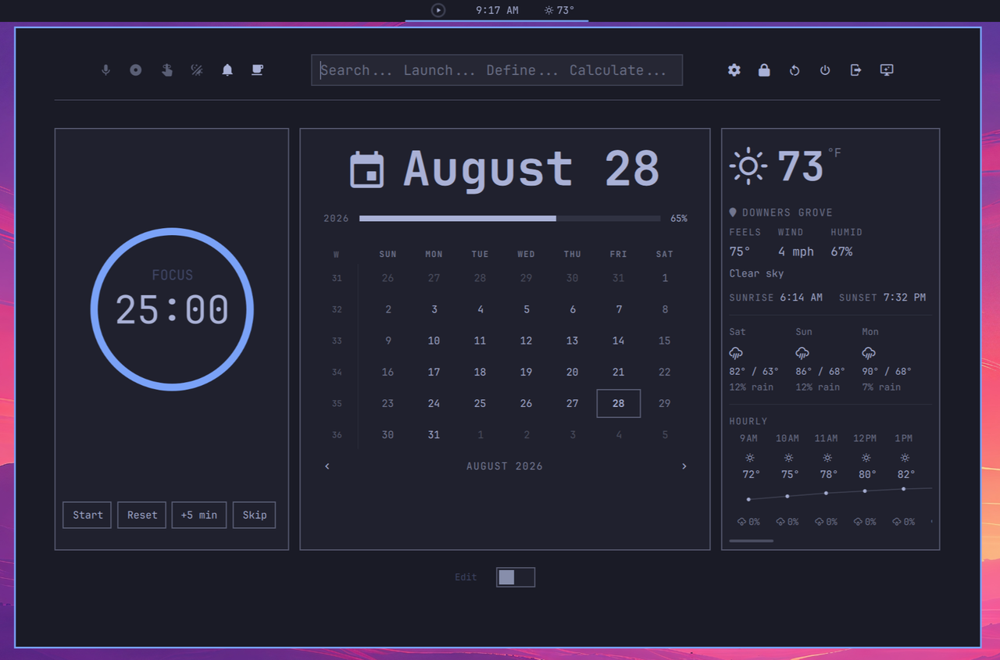

# OmaDash

A malleable HUD/dashboard plugin for [Omarchy](https://omarchy.org). OmaDash
adds a compact bar pill (Pomodoro · clock · weather) that expands into a full
dashboard: quick actions, a launcher-style search, system shortcuts, and a
corkboard of pinnable plugin cards.



## Features

- **Compact bar pill** — three slots at a glance: Pomodoro (left), clock
  (center), and weather (right). Click anywhere on the pill to open the
  expanded dashboard.
- **Expanded dashboard** — a tiled card grid that autosizes to its content and
  opens centered on the bar.
  - **Pomodoro** — focus countdown with three compact display modes (ring,
    ring + clock, bare clock), persisted per preference.
  - **Clock** — date + time with a unit/format preference.
  - **Weather** — current conditions, a 3-day forecast, a scrollable hourly
    list, sunrise/sunset, and live unit (°C/°F) toggle.
  - **Calendar** — month view with year progress.
  - **Notifications** — notification history.
- **Launcher-style search** — apps, files, calculator (math), dictionary
  definitions, unit conversion, web keywords (`gg:` `dd:` `wiki:` `gh:`), and
  Hyprland window switching, all scored and merged into one list.
- **Corkboard** — pin any installed Omarchy plugin into a card:
  - *Live panels* — the plugin's real popup UI (network, audio, bluetooth,
    power, …) embedded directly inside the card via content adoption.
  - *Launcher tiles* — one-click summons for overlay/menu plugins via IPC.
- **Row-aware flex tiler** — a Hyprland-style packer. Each plugin carries a
  persisted `row`; the grid starts a new visual row on a row-number change or
  on overflow, so *you* decide where rows break — not the width.
- **Edit mode** — drag cards between rows with animated push (half-split drop
  targets), remove them, and re-add from a scanned plugin list.
- **Header actions** — a replica of Omarchy's built-in indicators (dictation,
  screen recording, reminder, night light, DND, stay awake) on the left, and
  system shortcuts (lock, reboot, shutdown, logout, screensaver, settings) on
  the right.
- **Live data** — weather via Open-Meteo (no API key; shares Omarchy's
  configured location) and a Pomodoro focus timer.

## Architecture

```
omadash/
├── BarWidget.qml            # bar entry point; owns the compact pill + panel
├── Panel.qml                # expanded dashboard surface (layer-shell)
├── components/
│   ├── CollapsedBar.qml     # compact pill: Pomodoro | Clock | Weather
│   ├── DashboardTiler.qml   # row-aware flex packer + drag/drop
│   ├── DashboardCard.qml    # one plugin card (panel host / view / tile)
│   ├── PanelHost.qml        # embeds a real plugin panel's UI in a card
│   ├── SearchLauncher.qml   # unified search/launcher
│   ├── ExpandedPanel.qml    # header (quick actions | search | shortcuts)
│   ├── AddPluginDialog.qml  # scanned-plugin picker
│   ├── WeatherExpanded.qml / PomodoroExpanded.qml / CalendarView.qml / …
│   └── DashboardRegistry.js # id → descriptor (view / launcher / panel)
└── engine/
    ├── WeatherEngine.qml    # shared weather singleton (Open-Meteo)
    ├── PomodoroEngine.qml   # shared focus-timer singleton
    └── DashboardConfig.qml  # persisted layout + settings (singletons)
```

**Why state lives outside the plugin directory.** Layout and settings are
written to `~/.config/omarchy/omadash/` (not inside `plugins/omadash/`). Writing
inside the plugin directory trips Omarchy's plugin watcher, which reloads the
whole plugin and closes any open dashboard on every persist. Keeping state
outside avoids that.

## Install

```sh
omarchy plugin add https://github.com/djmenig/omadash.git --enable
omarchy restart shell
```

If the pill lands somewhere other than the center of the bar:

```sh
omarchy bar move omadash --section center
```

You can also clone/symlink the repo to `~/.config/omarchy/plugins/omadash` and
restart the shell.

## Usage

- **Left-click the pill** — open/close the dashboard.
- **Edit switch** (bottom-right) — enter edit mode: drag cards (the left/right
  half of a card decides the drop side), remove them, or add new ones via the
  **+** button.
- **Search** — type to search; ↑/↓ navigate, Enter activates, Esc clears.
- **Right-click** the Pomodoro pill cycles its compact display mode;
  **right-click** the temperature toggles °C/°F.
- Layout and preferences persist across restarts
  (`~/.config/omarchy/omadash/dashboard.json` and `settings.json`).

## Requirements

- Omarchy (Quickshell-based shell).
- Network access for weather (Open-Meteo); everything else works offline.

## Roadmap — Future Releases

### v0.2.0 — Pages

The expanded dashboard will support **three pages**: a **center** page (the
current default landing page) plus a **left** page and a **right** page. A
**dot paginator** will sit at the bottom of the expanded dashboard, directly
**above the edit button**, letting you switch pages at a glance. Each page
keeps its own card layout and arrangement, persisted alongside the current
per-plugin `row` metadata. Edit mode will operate on the active page, so the
three pages function as independent, rearrangeable corkboards.

### Later

- **Tiling system improvements** — evolve the row-aware flex packer beyond the
  current fixed `row`-driven breaks toward a more fluid layout engine. Cards
  should reflow intelligently as the popup resizes, with content that adapts
  like a responsive web page: widgets scale, rewrap, and recompose to fill the
  available space instead of relying on manual row assignments. The goal is
  flexible card content with dynamic, website-style resizing rather than
  static, user-placed grids.
- **Compact-mode slot selection & bar-widget swapping** — a per-card, edit-mode
  affordance to assign which plugin's compact widget occupies each pill slot,
  so you can, for example, drop the Notification Panel into **Slot A** in place
  of Pomodoro. Any added plugin that ships a *bar widget* becomes a candidate
  for a slot, with a safeguard that a slot holds exactly one plugin at a time
  (mutual exclusion). This requires a plugin-side "compact widget" contract
  before it can be fully generic.
- **Curated add-plugin picker** — filter the **Add plugin** selector down to
  plugins that expose a live-embeddable `KeyboardPanel` (the species OmaDash can
  actually render inside a card). Everything else, which would only ever be a
  static launcher tile or show nothing useful when pinned, is noise and will be
  hidden rather than cluttering the picker.
- **More card species** — additional built-in views and richer live-panel
  embedding (e.g. scrolling/paged panel content).
- **Theming & density controls** — card sizing presets and accent behavior.

## License

MIT — see [LICENSE](LICENSE).
